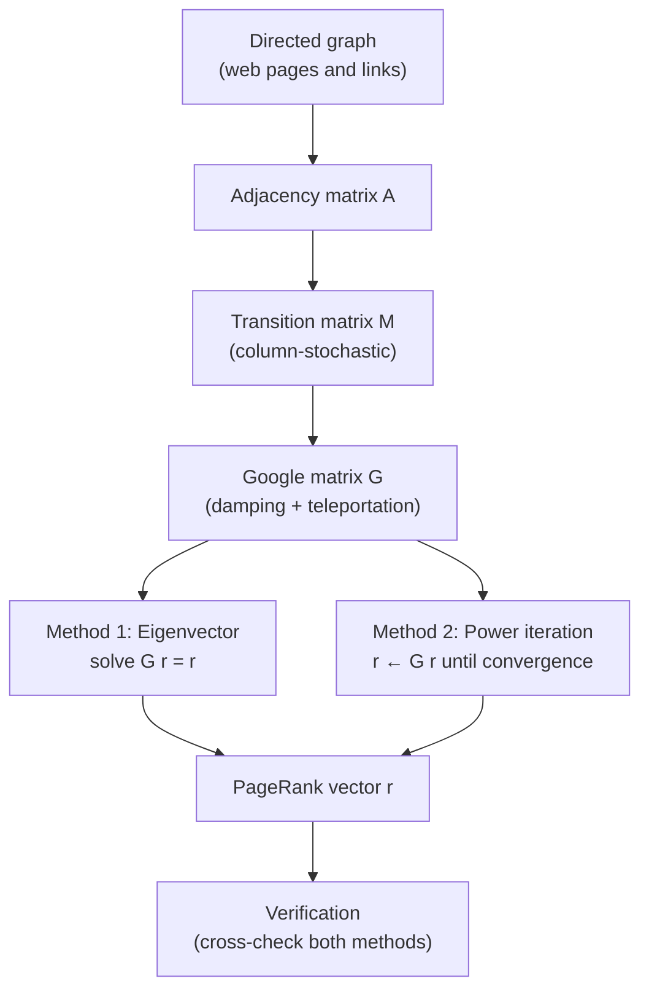

# matrix-eigenvalues-pagerank
# Matrix Eigenvalues and Google's PageRank Algorithm

A mathematical and computational study of eigenvalues, eigenvectors, and Google's PageRank algorithm.

## Project Overview

PageRank is a link-analysis algorithm that ranks web pages based on the structure of links between them. This project studies the mathematical foundation of PageRank using matrix operations, eigenvalues, and eigenvectors.

The project implements PageRank in Python and demonstrates two approaches:

1. **Eigenvector method** — PageRank is obtained from the eigenvector corresponding to eigenvalue 1 of the Google matrix.
2. **Power iteration method** — PageRank is obtained iteratively using repeated matrix-vector multiplication.

The implementations are verified using numerical checks and compared with NetworkX.

## Mathematical Foundation

A directed web graph is represented using an adjacency matrix \(A\).

From this, a column-stochastic transition matrix \(M\) is constructed:

\[
M_{ij} = P(\text{page }j \rightarrow \text{page }i)
\]

Dangling pages, which have no outgoing links, are assigned a uniform probability distribution.

The Google matrix is then constructed as:

\[
G = dM + (1-d)\frac{1}{N}E
\]

where:

- \(d\) is the damping factor, typically \(0.85\)
- \(N\) is the number of pages
- \(E\) is an \(N\times N\) matrix of ones

The PageRank vector \(PR\) satisfies:

\[
GPR = PR
\]

Therefore, PageRank is the normalized eigenvector corresponding to the eigenvalue:

\[
\lambda = 1
\]

### Power Iteration

The same PageRank vector can be obtained iteratively:

\[
PR^{(k+1)} = GPR^{(k)}
\]

The iteration continues until the difference between successive PageRank vectors falls below a specified tolerance.

## Pipeline

## What each stage does

| Stage | Object | Definition |
|---|---|---|
| 1. Graph | Directed graph, n nodes | Edge `j → i` means page j links to page i |
| 2. Adjacency | `A` (n × n, entries 0 or 1) | `A[i][j] = 1` if `j → i`, so column j lists the outlinks of j |
| 3. Transition | `M` | `M[i][j] = A[i][j] / outdeg(j)`, so every column sums to 1. Dangling nodes (no outlinks) get a uniform column `1/n` |
| 4. Google matrix | `G` | `G = α·M + (1 − α)/n · J`, where `J` is the all-ones matrix and damping `α = 0.85` |
| 5a. Eigenvector | `G r = r` | `r` is the eigenvector for eigenvalue 1, normalized so `Σ r[i] = 1` |
| 5b. Power iteration | `r_next = G · r` | Start from `r = (1/n, …, 1/n)`; stop when `‖r_next − r‖₁ < ε` |
| 6. Verification | Consistency checks | See below |

## Verification checks

1. `Σ r[i] = 1` and every `r[i] > 0`
2. Residual `‖G r − r‖₁ ≈ 0`
3. Eigenvector result and power-iteration result agree within tolerance
4. Ranking matches `networkx.pagerank(G, alpha=0.85)`
